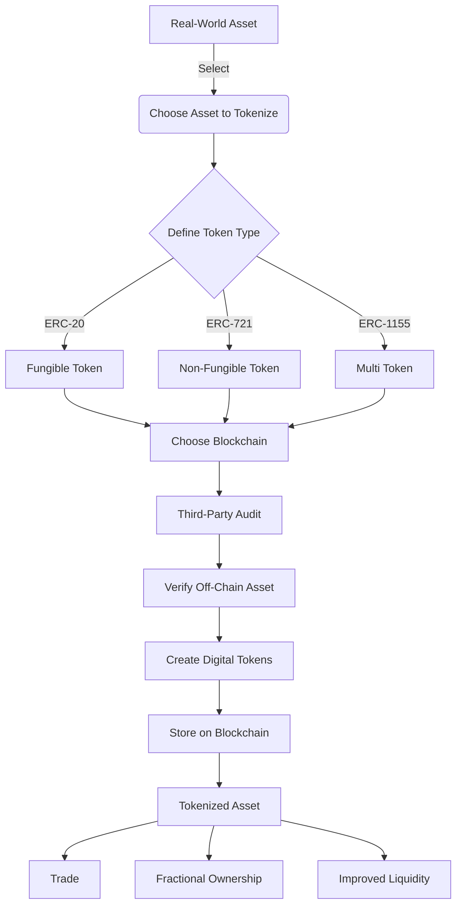

# Chainlink Bootcamp

https://cll-devrel.gitbook.io/tokenized-rwa-bootcamp-2024

# Asset Tokenization Explained

## What is Asset Tokenization?

Asset tokenization is the process of creating a digital representation of a real-world asset on a blockchain. It's like creating a digital version of something valuable in the physical world.

## The Process of Asset Tokenization

1. **Choose the Asset**: Select what you want to tokenize (e.g., art, real estate, stocks).
2. **Define Token Type**: Decide on the type of digital token you'll create (e.g., ERC-20, ERC-721, ERC-1155).
3. **Select Blockchain**: Pick which blockchain system you'll use.
4. **Third-Party Verification**: Get a trustworthy entity to verify that the real asset exists and is valuable.
5. **Create Tokens**: Generate the tokens in a way that ensures they accurately represent the real asset.

## Benefits of Asset Tokenization

- Easier and faster buying, selling, and trading of assets
- Increased accessibility to expensive assets through fractional ownership
- Greater transparency due to blockchain record-keeping
- Potential cost reduction by removing intermediaries

## Visual Representation

This diagram illustrates the process of transforming a physical asset into a digital token, and the benefits that come with tokenization.

## Key Factors for Successful Asset Tokenization

1. **Security**: Ensuring the safety of the digital tokens and the underlying assets.
2. **Automated Verification**: Using smart contracts to automatically verify the off-chain reserves backing an asset.
3. **Transparency**: Providing real-time proof of collateralization to increase user confidence.
4. **Interoperability**: Ensuring tokens can work across different blockchain environments for broader accessibility.

# Understanding Token Types: Fungible, Non-Fungible, and Multi Tokens

In the world of blockchain and cryptocurrency, there are different types of tokens. Here's a simple explanation of three main types:

## 1. Fungible Tokens (e.g., ERC-20)

- **Definition**: Tokens that are identical and interchangeable with each other.
- **Characteristics**:
    - Each token is exactly the same as every other token of its type.
    - They can be divided into smaller units.
    - Any token can be replaced by another token of the same type.
- **Real-World Analogy**: Dollar bills or grains of rice.
- **Examples**: Most cryptocurrencies like Bitcoin, Ethereum tokens.

## 2. Non-Fungible Tokens (NFTs, e.g., ERC-721)

- **Definition**: Unique tokens that represent ownership of a specific item or asset.
- **Characteristics**:
    - Each token is distinct and not interchangeable.
    - They often represent digital or physical assets.
    - They cannot be divided into smaller units.
- **Real-World Analogy**: Unique collectibles or one-of-a-kind artworks.
- **Examples**: Digital art, virtual real estate, unique in-game items.

## 3. Multi Tokens (e.g., ERC-1155)

- **Definition**: Tokens that can represent both fungible and non-fungible items within a single smart contract.
- **Characteristics**:
    - Can handle both interchangeable and unique tokens.
    - More efficient for transfers and

# Tokenized Real-World Assets (RWAs)

Tokenized Real-World Assets (RWAs) are digital versions of physical assets like money, property, or art, represented on blockchain networks. These tokenized assets are expected to play a significant role in the future of finance by enabling new opportunities in digital markets.

## Key Requirements for RWAs

For RWAs to be successful, they need to meet the following three requirements:

1. **Real-World Information Integration**: Accurate real-world data must be associated with the tokenized assets.
2. **Interoperability Across Blockchains**: The ability to transfer RWAs between different blockchain networks.
3. **Connection to Off-Chain Data**: RWAs need to stay connected to real-world information, even when moving across blockchains.

## Chainlink's Role in RWAs

Chainlink is a decentralized oracle network that addresses the challenges faced by RWAs. It is already widely adopted for various financial transactions and provides the infrastructure needed to make RWAs functional, secure, and reliable.

### Adding Information to RWAs

Chainlink facilitates the addition of essential data to RWAs, such as:

- Proof of asset backing
- Identity verification
- Real-time valuation data

This ensures that RWAs are trustworthy and useful for a wide range of applications.

### Moving RWAs Between Blockchains

Chainlink's Cross-Chain Interoperability Protocol (CCIP) enables RWAs to move seamlessly between different blockchain networks. As the future of blockchain will likely involve multiple networks, interoperability is crucial for RWAs to operate in various ecosystems.

### Keeping RWAs Updated

When RWAs move between different blockchains, Chainlink ensures that their information remains up-to-date. This is critical for maintaining accurate records and ensuring the assets reflect their true value and status at all times.

### Making RWAs Programmable

Chainlink's CCIP also allows RWAs to be used in more sophisticated financial transactions across multiple blockchains. This programmability opens the door to more flexible and powerful financial operations involving RWAs, making them more versatile in various use cases.

## Conclusion

In summary, Chainlink is solving the key challenges associated with tokenizing real-world assets. Its technology makes RWAs more useful, secure, and transferable across different blockchain networks, helping to shape the future of blockchain-based finance.

# Chainlink and Tokenized Real-World Assets (RWAs): A Real Estate Example

Let's explore how Chainlink's technology can be applied to tokenized real-world assets (RWAs) using a tokenized piece of real estate as an example. Imagine you own a valuable property in New York City, and you decide to tokenize it on a blockchain. Here’s how Chainlink's features would enhance the process:

## Creating and Enriching the Token

You create a digital token representing your NYC property on a blockchain. Chainlink helps by adding essential real-world data to this token, such as:

- **Market Value Updates**: Chainlink regularly updates the token with the current market value of your property.
- **Proof of Ownership**: Chainlink links the token to official records, proving that you own the property.
- **Tax Payment History**: Information about recent property tax payments is attached to the token for verification.
- **Occupancy Status**: The current status of the property (whether it’s rented or vacant) is added to the token for more transparency.

## Moving the Token Between Blockchains

Suppose you initially tokenize your property on the Ethereum blockchain but want to make the token available on other blockchains to attract more investors. Chainlink's Cross-Chain Interoperability Protocol (CCIP) allows you to securely transfer your property token from Ethereum to other blockchains, such as the Binance Smart Chain. This expands your reach to different markets and investors.

## Keeping the Token Updated

Even after moving your property token to another blockchain, it’s crucial that the token remains up-to-date. Chainlink ensures that the following data stays current on any blockchain:

- **Market Value**: The token continues to receive updates about the property's market value on the new blockchain.
- **New Information**: Updates, like property renovations or changes in tax status, are added to the token.
- **Proof of Ownership**: Chainlink ensures that proof of ownership remains valid and verifiable, regardless of which blockchain the token resides on.

## Making the Token Programmable

Chainlink’s technology also makes your property token programmable, enabling automatic actions based on specific conditions. For example:

- **Automatic Notifications**: If the property’s value increases by 20%, Chainlink can automatically notify all token holders.
- **Tax Alerts**: If property tax hasn’t been paid for 30 days, Chainlink can trigger an automatic freeze on any further token transfers until the issue is resolved.
- **Fractional Ownership**: Chainlink enables you to allow fractional ownership of the property, where multiple people can own parts of the tokenized property.

## Conclusion

This real-world example demonstrates how Chainlink’s technology enhances the utility, mobility, and functionality of tokenized real estate assets. By integrating real-world data, ensuring cross-chain compatibility, keeping assets updated, and enabling programmable features, Chainlink opens up new ways of investing in and managing real estate across different blockchain networks.

# Real Estate Tokenization Explained

## Overall Goal:
We're creating a digital token that represents a piece of real estate. This token can be divided into smaller parts, allowing multiple people to own a share of the property.

---

## Asset Selection:
- We're using a **real property** as our asset.
- We'll get information about this property from **Zillow's API** (a service that provides real estate data).
- This is just a **representation** of the property, not actually buying or selling real estate.

---

## Token Type:
- We're using a special type of token called **ERC-1155**.
- This type of token allows us to:
  - a) **Divide the property into fractions** (like ERC-20 tokens).
  - b) **Attach unique information to the token** (like ERC-721 tokens, often used for NFTs).

---

## Blockchain Choice:
- We're starting on the **Avalanche Fuji blockchain**.
- However, using **Chainlink's CCIP** (Cross-Chain Interoperability Protocol), we can move the token to other blockchains later.

---

## Connecting to Real-World Data:
To keep our token updated with real-world information, we're using two Chainlink services:
- a) **Chainlink Functions**: This allows us to fetch data from Zillow's API and bring it onto the blockchain.
- b) **Chainlink Automation**: This will automatically update our token's data daily.

---

## In Summary:
We're creating a digital token that:
- Represents a real property.
- Can be **divided** among multiple owners.
- Starts on **one blockchain** but can move to others.
- Stays **updated with real-world data** automatically.

This demonstrates how blockchain technology can be used to create new ways of investing in and managing real estate.

