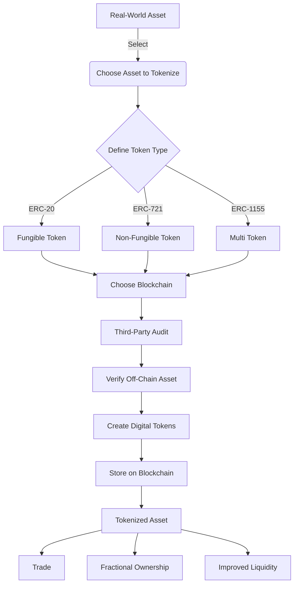

# Chainlink Bootcamp

https://cll-devrel.gitbook.io/tokenized-rwa-bootcamp-2024

# Asset Tokenization Explained

## What is Asset Tokenization?

Asset tokenization is the process of creating a digital representation of a real-world asset on a blockchain. It's like creating a digital version of something valuable in the physical world.

## The Process of Asset Tokenization

1. **Choose the Asset**: Select what you want to tokenize (e.g., art, real estate, stocks).
2. **Define Token Type**: Decide on the type of digital token you'll create (e.g., ERC-20, ERC-721, ERC-1155).
3. **Select Blockchain**: Pick which blockchain system you'll use.
4. **Third-Party Verification**: Get a trustworthy entity to verify that the real asset exists and is valuable.
5. **Create Tokens**: Generate the tokens in a way that ensures they accurately represent the real asset.

## Benefits of Asset Tokenization

- Easier and faster buying, selling, and trading of assets
- Increased accessibility to expensive assets through fractional ownership
- Greater transparency due to blockchain record-keeping
- Potential cost reduction by removing intermediaries

## Visual Representation

This diagram illustrates the process of transforming a physical asset into a digital token, and the benefits that come with tokenization.

## Key Factors for Successful Asset Tokenization

1. **Security**: Ensuring the safety of the digital tokens and the underlying assets.
2. **Automated Verification**: Using smart contracts to automatically verify the off-chain reserves backing an asset.
3. **Transparency**: Providing real-time proof of collateralization to increase user confidence.
4. **Interoperability**: Ensuring tokens can work across different blockchain environments for broader accessibility.

# Understanding Token Types: Fungible, Non-Fungible, and Multi Tokens

In the world of blockchain and cryptocurrency, there are different types of tokens. Here's a simple explanation of three main types:

## 1. Fungible Tokens (e.g., ERC-20)

- **Definition**: Tokens that are identical and interchangeable with each other.
- **Characteristics**:
    - Each token is exactly the same as every other token of its type.
    - They can be divided into smaller units.
    - Any token can be replaced by another token of the same type.
- **Real-World Analogy**: Dollar bills or grains of rice.
- **Examples**: Most cryptocurrencies like Bitcoin, Ethereum tokens.

## 2. Non-Fungible Tokens (NFTs, e.g., ERC-721)

- **Definition**: Unique tokens that represent ownership of a specific item or asset.
- **Characteristics**:
    - Each token is distinct and not interchangeable.
    - They often represent digital or physical assets.
    - They cannot be divided into smaller units.
- **Real-World Analogy**: Unique collectibles or one-of-a-kind artworks.
- **Examples**: Digital art, virtual real estate, unique in-game items.

## 3. Multi Tokens (e.g., ERC-1155)

- **Definition**: Tokens that can represent both fungible and non-fungible items within a single smart contract.
- **Characteristics**:
    - Can handle both interchangeable and unique tokens.
    - More efficient for transfers and